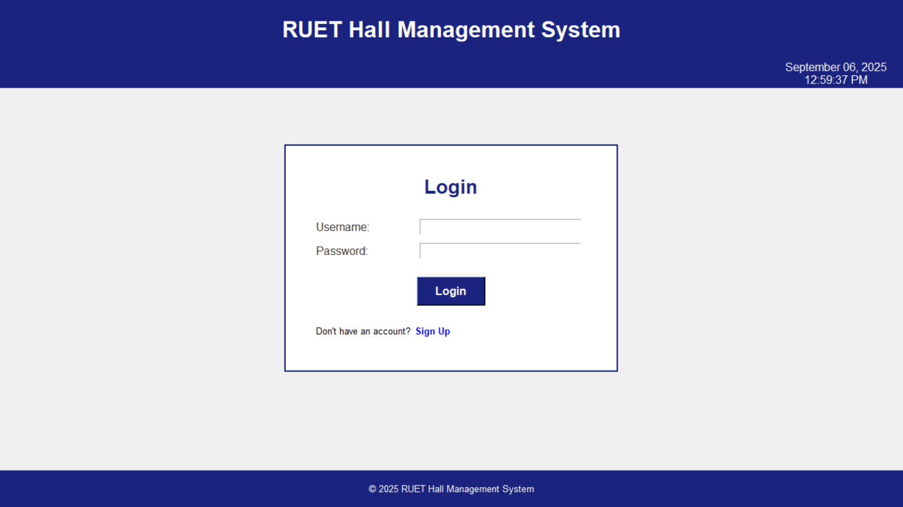
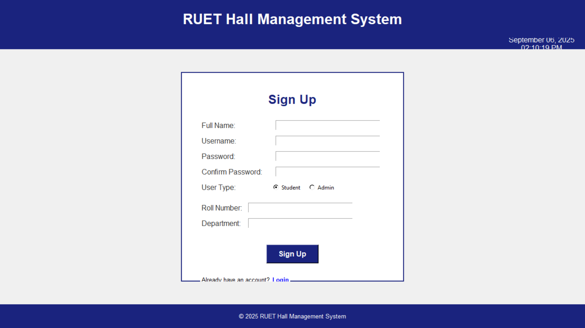
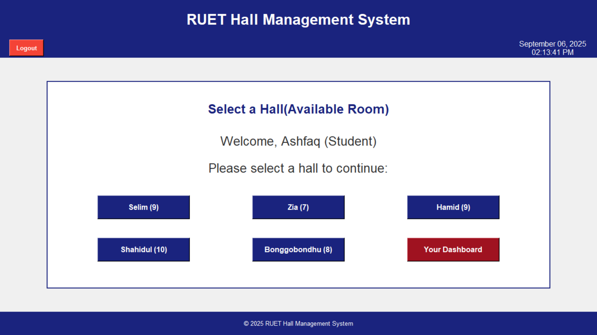
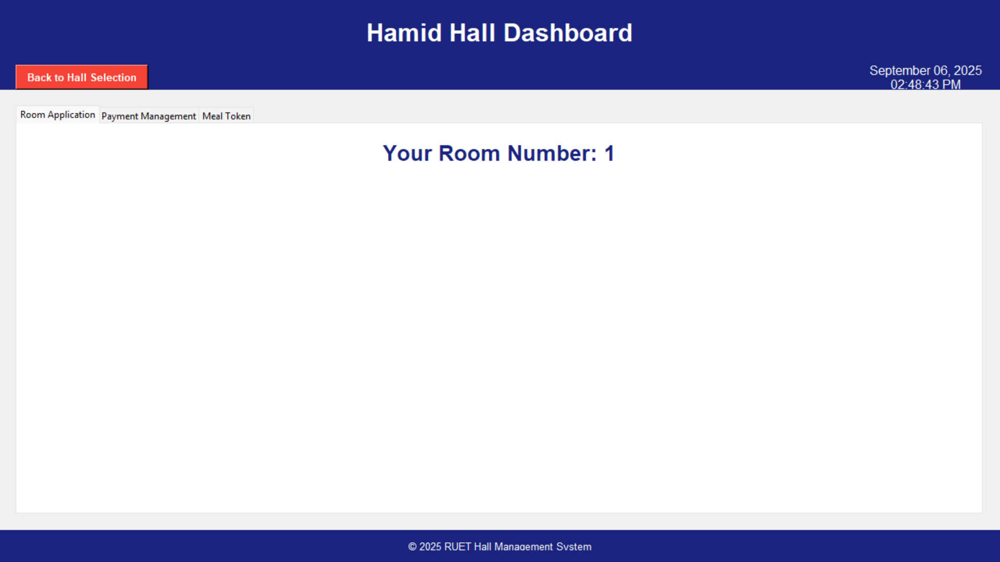
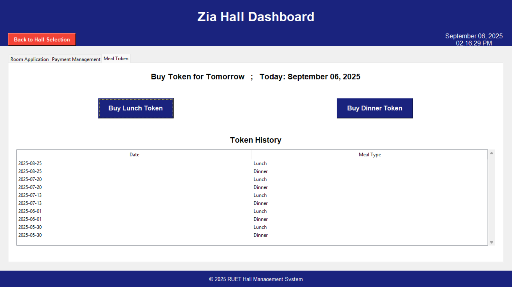
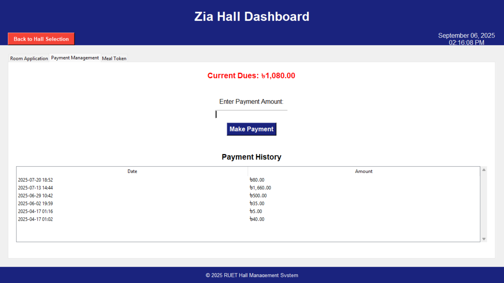
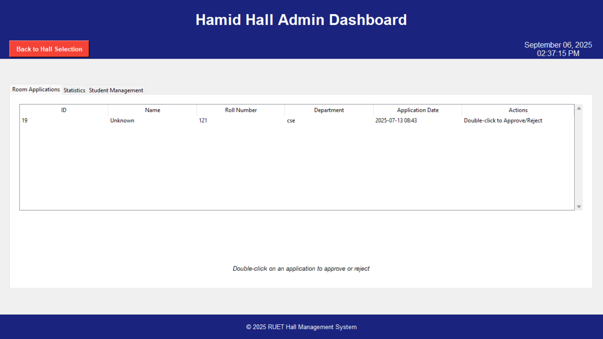
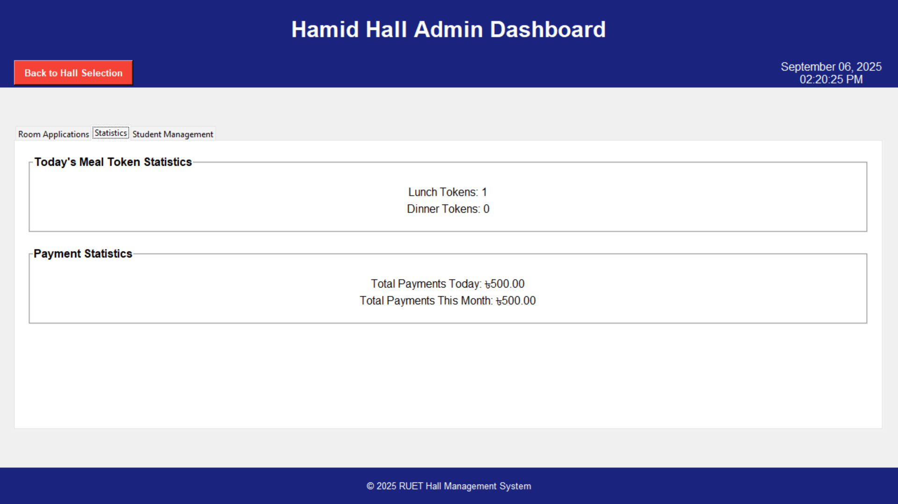
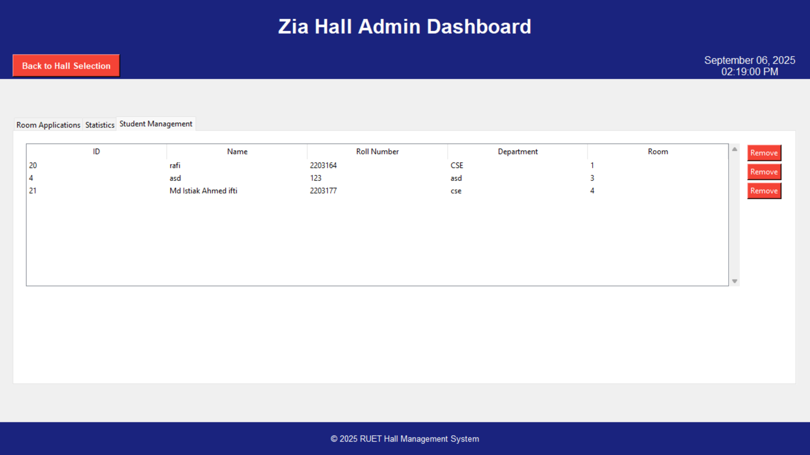

# 🏠 RUET Hall Management System
**License:** MIT  

The **RUET Hall Management System** is a desktop application built using **Python (Tkinter)** and **MySQL**, developed to automate and simplify hall-related activities for students and administrators at Rajshahi University of Engineering & Technology (RUET).  

This system streamlines student room applications, meal booking, and payment management, ensuring transparency, accuracy, and real-time tracking.  

---

## 🎯 Objectives
- Automate hall room application and approval process  
- Provide an online meal token booking system (Lunch/Dinner)  
- Calculate monthly dues based on room stay and meals consumed  
- Secure login/signup for both students and admins  
- Enable admins to monitor meals booked, approve applications, and manage payments  

---

## 🛠️ Tech Stack
- **Python 3** – Core programming language  
- **Tkinter** – GUI development  
- **MySQL** – Backend database  
- **SQL** – Queries & data management  
- **Datetime Module** – Time/date handling  
- **OOP (Object-Oriented Programming)** – Code structuring  

---

## 🚀 System Features

### 🔐 Login & Signup
- Role-based access (Student/Admin)  
- Password hashing for security  
- Real-time date & time display  
- Error handling & session management  

### 👨‍🎓 Student Role
- Apply for hall room (default: 10 rooms/hall)  
- Book meal tokens (Lunch/Dinner)  
- Payment system with due calculation:  
Due = (Months stayed × 500) + (Meals consumed × 40)
- Track payment history  

### 🛠️ Admin Role
- Approve/reject student applications  
- Auto-record approval date for rent calculation  
- Monitor daily meal bookings (Lunch/Dinner)  
- Track total payments collected  
- Manage student details (view/remove students)  

---

## 🗄️ Database Structure (MySQL)
- **users** → id, username, password, user_type, hall, roll, dept, date_joined  
- **applications** → app_id, student_id, hall, status, application_date, approval_date  
- **meals** → meal_id, student_id, date, type (Lunch/Dinner)  
- **payments** → payment_id, student_id, amount, date  
- **dues** → student_id, room_months, meals_count, total_due, last_paid  

---

## ⚡ Challenges Faced
- Designing a full-screen, responsive Tkinter GUI  
- Real-time date & time integration with Tkinter (`after()` method)  
- Smooth Tkinter–MySQL integration  
- Ensuring data consistency & validation  
- Secure login sessions & password hashing  

---

## ✅ Outcomes
- A fully functional hall management desktop app  
- Reduced manual paperwork  
- Role-based authentication (student vs admin)  
- Tested successfully on dummy data  

---

## 🔮 Future Scope
- QR code-based meal check-in  
- Web-based version using Flask/Django  
- Mobile app version for students  
- Integration with RUET’s official student database  

---

## 📸 App Preview (Screenshots)
## For Students:
### 🔐 Login & Signup  
  
  

### 📊 Dashboard

  

### 🍴 Meal Booking  
  

### 💰 Payment System  
  

## For Admin
###  Approve Applications  
 
### 💰 Payment Overview
 
### 🍴 Meal Booking  
 
---

## ▶️ Getting Started

### ✅ Prerequisites
- Python 3.x  
- MySQL Server  
- VS Code / PyCharm  
